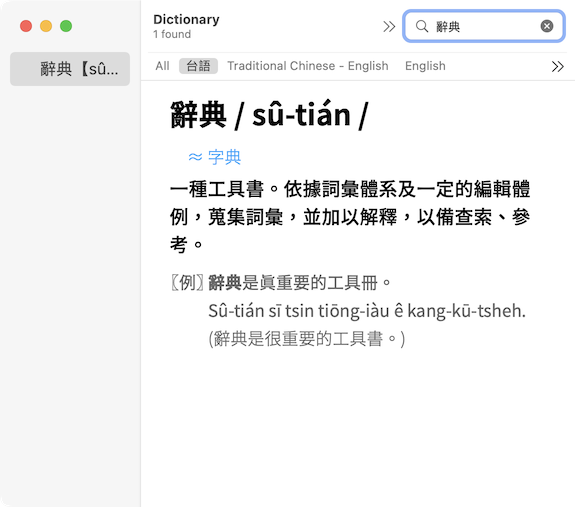
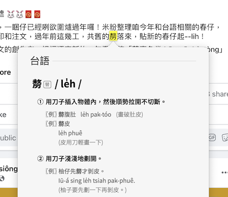
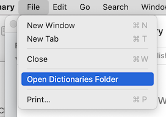
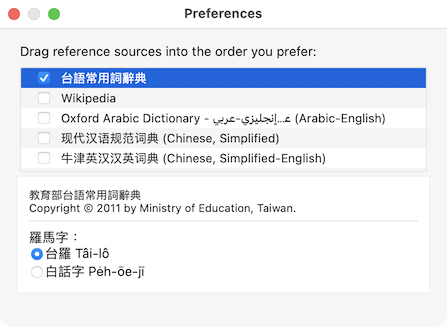

# 台語常用詞辭典

將教育部《臺灣閩南語常用詞辭典》製作成 macOS 內建的辭典格式，可以直接在任何 app 內用右鍵查詢台語詞彙。支援台羅及白話字。

-----
## 授權

- 原始資料來自[教育部《臺灣閩南語常用詞辭典》](https://twblg.dict.edu.tw/holodict_new/)文字部分，採用[創用CC姓名標示-禁止改作 3.0 臺灣](https://twblg.dict.edu.tw/holodict_new/compile1_6_1.jsp)授權條款。
- 結構化資料採用[g0v/moedict-data-twblg](https://github.com/g0v/moedict-data-twblg)整理過後的JSON，以CC0釋出。
- 字體採用ButTaiwan製作的[源石黑體](https://github.com/ButTaiwan/genseki-font)，採用[SIL Open Font License 1.1](https://opensource.org/licenses/OFL-1.1)授權。

-----
## 安裝

1. 去 [release](https://github.com/yllan/taigi-sutian/releases) 頁面，把 Assets 展開，下載最新版的 `dictionary.zip`。

2. 解壓縮，得到一個檔案夾 `台語常用詞辭典.dictionary`。

3. 啟動 `/Applications/Dictionary.app`

4. 選擇「File」選單下的「Open Dictionaries Folder」

5. 將第2步的 `台語常用詞辭典.dictionary` 整個丟到上一步開啟的 `Dictionaries` 檔案夾。

6. 關閉 `Dictionary.app` 再重新開啟。

7. 打開設定「Preferences」，在列表中尋找「台語常用詞辭典」，並設定要使用台羅或是白話字。

-----

## 疑難排除

### 電腦上有許多台語的漢字無法顯示。

請參考[台語文字的字型發展現況-下](https://kian-tiong.medium.com/台語文字的字型發展現況-下-2574f0961a85)，安裝支援Unicode Ext-G區的台語字型。

-----
## BUILD

TBD

## Ref

- [Dictionary Services Programming Guide](https://developer.apple.com/library/archive/documentation/UserExperience/Conceptual/DictionaryServicesProgGuide/Introduction/Introduction.html)